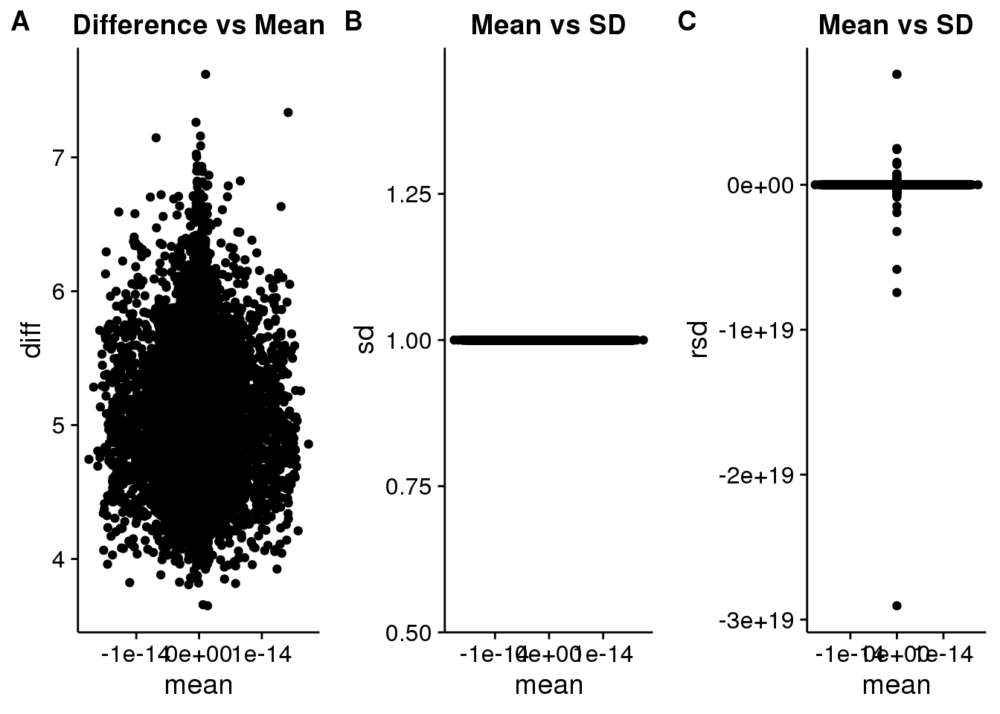
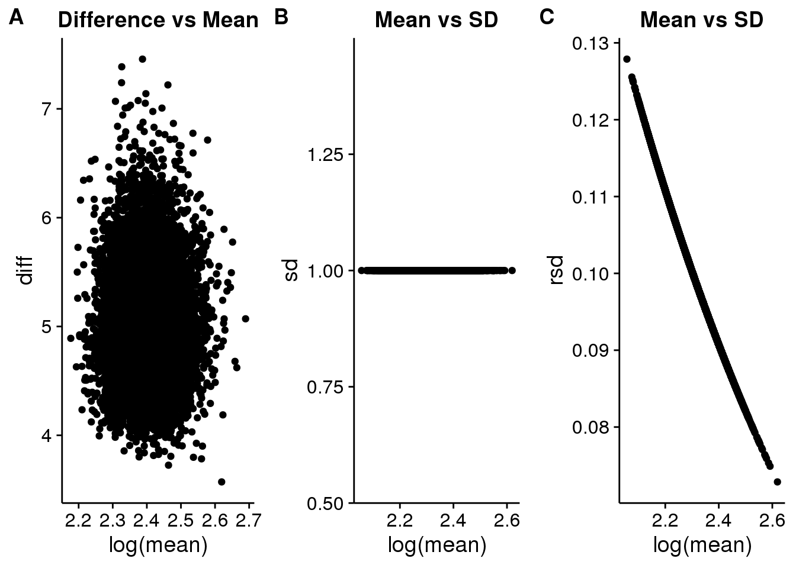
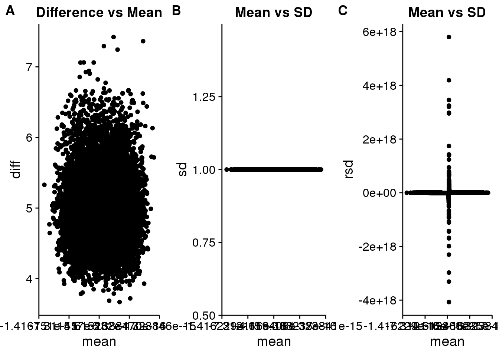
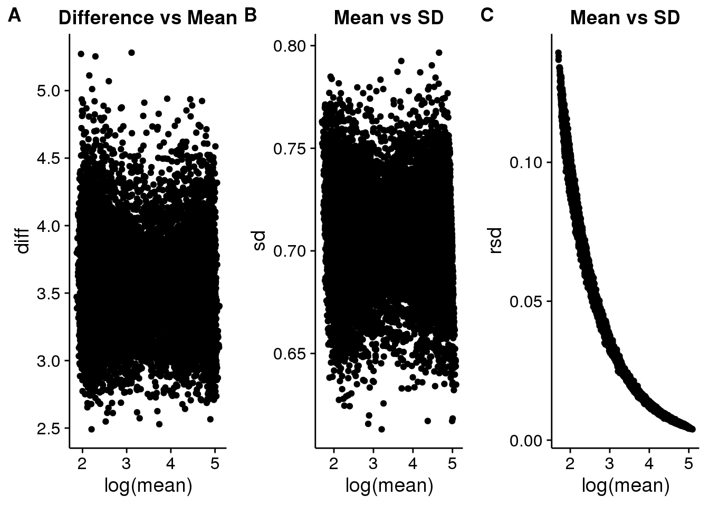
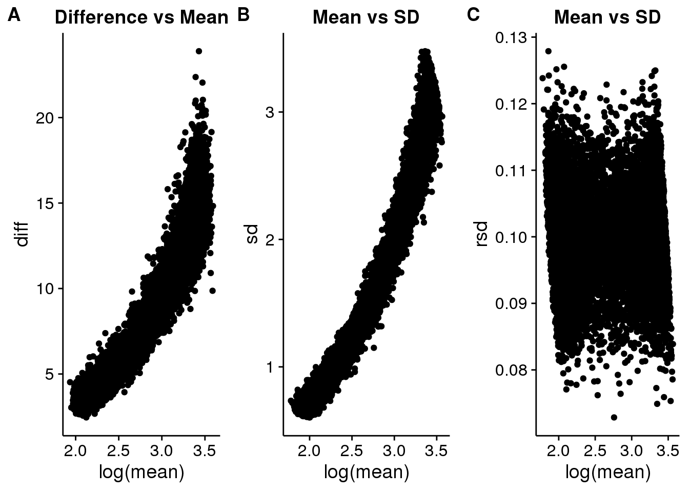
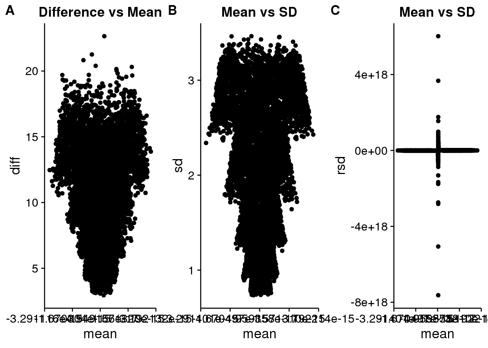

# Introduction

Various scalings and transformations are often applied to different -omics data
to modify specific properties of the data, these generally make the data more
amenable to various statistical procedures. Most common are modifications in the
error structure, often going from multiplicative errors that are commonly
present in any data generated by counts at a detector (essentially all
high-throughput -omics data) to additive errors, which most statistical methods
expect.

Previous work has examined the influence of scalings and transformations on both
the structure of the data and the errors through the use of replicated nuclear 
magnetic resonance (NMR) (REF) and coupled gas chromatography mass spectrometry
(GC-MS) experiments (REF). Although insightful, these works did not provide direct
control over the exact type and amount of error present in the data. Most of the discussion in previous work also concentrated on the shape of
the spectra after scaling and transformation. However, in many other -omics data
types outside of the metabolomics where NMR and GC-MS are applied, there is no
real spectra, but simply an aggregation of values measured on independent
features, and therefore changes in shape of the overall spectra are largely
irrelevant.

In the following, we demonstrate that the use of a simple summary of replicate 
experiments consisting of the **mean**, **maximum** - **minimum**, **standard
deviation** (sd), and **relative standard deviation** (rsd) is useful as a
visual indicator of the presence and type of errors in various -omics
datasets. A simple plot of both the **mean vs sd** and **mean vs rsd** is able
to determine whether the errors in an experiment are primarily **additive**
(random, constant, baseline error), **proportional** (dependent on the signal
value), or a **mixture**. From this visual summary, it is also possible to
evaluate the impact of different scalings and transformations on the error
structure in the data.

We evaluate the impact of the scalings and transformations through the use of 
synthetic data where specific amounts of **additive** and **proportional** error
have been added.

# Methods


## Data


Simulated data was generated by drawing points from two different distributions:
1) log-normal distribution with a mean in log-space of 1 and a standard
deviation of 1 (see histogram in Figure X); 2) a uniform distribution over the
range of 5 - 100, with 5000 points in each distribution. A value of `r
offset` was added to the data purely to avoid values <= 1 following the addition
of error, making visualization easier. These data points are the **pure**
initial data to which different types of error are added. From this set, `r
n_rep` replicates are generated with either *additive* (`add`), *proportional*
(`prop`) or *mixed* (both additive and proportional, `mixed`) error.


### Additive Error


Additive error was added where the standard deviation was 0.5. A plot
of two replicates is shown in Figure X.

### Proportional Error


Proportional error was added with a relative standard deviation of 0.1. A
plot of two replicates is shown in Figure X.

### Mixed Error


A mixture of additive and proportional errors was added using standard deviations
and relative standard deviations of 0.5 and 0.1 respectively.


## Transformations

The transformations applied to the data include autoscaling, pareto scaling, 
log-transform (natural log), and power transform (using roots of 2 and 5).

# Results

Very often, high-throughput -omics replicates are visualized in a pairwise
manner, by plotting the replicates directly against each other, or rotating them
by 45 degrees as a Bland-Altman or MA plot (see Figure Xa and b). Overviews of
many replicate / samples can be provided by summarizing each pair by the
correlation or root mean squared error (RMSE), however neither of these provide
a way to view how or if errors are related to the value of a feature across all
replicates. The pairwise MA plot allows this for pairs, but examining a large
number of pairwise plots is tedious.

One simple extension is for each feature, to plot the difference between the
minimum and maximum value across replicates, vs the mean value, as shown in
Figure Xc. A more robust metric with essentially the same information is to plot the
standard deviation against the mean. This actually shows if there is
any relationship between the error (standard deviation) and the mean, which can
provide an indication of whether there is additive, or proportional errors
present. Adding a plot of the *relative standard deviation* (RSD, SD / mean) *vs the
mean* as well as *sd vs mean*  makes it possible to discern the presence of
additive, proportional, or mixed error ( see Figures X-Y for examples).


## No Transformation

### Additive Error


### Proportional Error


### Mixed Error


## Auto-Scaling

### Additive



### Proportional



### Mixed




```
## [1] TRUE
```


Applying a variance or autoscaling to the data results in the removal of the 
additive error to a completely identical standard deviation of **1** across all
samples at all abundances (Figure X - Y). This applies across all of the
different error types. Although the standard deviation becomes identical and
constant, relatively it does not change, as the maximum *rsd* for the autoscaled
and the non-transformed data are idential, at 0.1799137, and the distribution
of the *rsd* does not change appreciably.


## Pareto Scaling

### Additive



### Proportional



### Mixed




```
## [1] TRUE
```

In contrast to autoscaling, pareto scaling modifies the values by the square
root of the variance. As shown in Figure X, this changes the absolute values of
the standard deviations, but does not change the distribution, or the dependence
of variance on the average abundance. In addition, the relative error remains
the same, as the maximum values of the rsd in the mixed error case for the
pareto scaled and non-transformed data are the same at 0.1799137.


## Log Transformation

### Additive Error


### Proportional Error


### Mixed Error


Log-transformations completely change the structure of the data. Figure X shows
that for the additive error only case, the SD vs mean looks more like the RSD vs
mean in the non-transformed case.

**NOTE HERE**: need to try generating all of of the SD and RSD histograms and
overlaying them with ggplot2 to see how well they match, because an initial comp
of `log_add` sd and `add_nozero` rsd looks really similar.


## Root Transform

A square root transform was applied to the data. The choice of using 2 as the
root is arbitrary, however depending on the size of the **tails** of the data
a higher root may be useful. 


### Additive Error


### Proportional Error


### Mixed Error


# Conclusion


# Session Information


```
##  setting  value                       
##  version  R version 3.2.3 (2015-12-10)
##  system   x86_64, linux-gnu           
##  ui       RStudio (0.99.862)          
##  language (EN)                        
##  collate  en_US.UTF-8                 
##  tz       America/New_York            
##  date     2016-01-29
```


|package                     |*  |version    |date       |source                                   |
|:---------------------------|:--|:----------|:----------|:----------------------------------------|
|assertthat                  |   |0.1        |2013-12-06 |CRAN (R 3.2.2)                           |
|circlize                    |   |0.3.2      |2015-10-21 |CRAN (R 3.2.2)                           |
|colorspace                  |   |1.2-6      |2015-03-11 |CRAN (R 3.2.2)                           |
|ComplexHeatmap              |   |1.7.1      |2015-10-10 |Github (jokergoo/ComplexHeatmap@e502955) |
|cowplot                     |*  |0.6.0      |2015-12-19 |CRAN (R 3.2.2)                           |
|DBI                         |   |0.3.1      |2014-09-24 |CRAN (R 3.2.2)                           |
|dendextend                  |   |1.1.2      |2015-10-31 |CRAN (R 3.2.2)                           |
|dendsort                    |   |0.3.3      |2015-12-14 |CRAN (R 3.2.2)                           |
|devtools                    |   |1.9.1.9000 |2016-01-21 |local                                    |
|digest                      |   |0.6.9      |2016-01-08 |CRAN (R 3.2.3)                           |
|dplyr                       |*  |0.4.3      |2015-09-01 |CRAN (R 3.2.3)                           |
|evaluate                    |   |0.8        |2015-09-18 |CRAN (R 3.2.2)                           |
|fakeDataWithError           |*  |0.0.1      |2015-10-19 |local                                    |
|formatR                     |   |1.2.1      |2015-09-18 |CRAN (R 3.2.2)                           |
|GetoptLong                  |   |0.1.0      |2015-03-09 |CRAN (R 3.2.2)                           |
|ggbiplot                    |   |0.55       |2015-10-19 |Github (rmflight/ggbiplot@7325e88)       |
|ggplot2                     |*  |2.0.0      |2015-12-18 |CRAN (R 3.2.2)                           |
|git2r                       |   |0.13.1     |2015-12-10 |CRAN (R 3.2.3)                           |
|GlobalOptions               |   |0.0.8      |2015-08-18 |CRAN (R 3.2.2)                           |
|gtable                      |   |0.1.2      |2012-12-05 |CRAN (R 3.2.2)                           |
|htmltools                   |   |0.2.6      |2014-09-08 |CRAN (R 3.2.2)                           |
|knitr                       |   |1.12       |2016-01-07 |CRAN (R 3.2.3)                           |
|labeling                    |   |0.3        |2014-08-23 |CRAN (R 3.2.2)                           |
|lazyeval                    |   |0.1.10     |2015-01-02 |CRAN (R 3.2.2)                           |
|magrittr                    |   |1.5        |2014-11-22 |CRAN (R 3.2.2)                           |
|memoise                     |   |0.2.1      |2014-04-22 |CRAN (R 3.2.2)                           |
|munsell                     |   |0.4.2      |2013-07-11 |CRAN (R 3.2.2)                           |
|plyr                        |   |1.8.3      |2015-06-12 |CRAN (R 3.2.2)                           |
|R6                          |   |2.1.1      |2015-08-19 |CRAN (R 3.2.2)                           |
|RColorBrewer                |   |1.1-2      |2014-12-07 |CRAN (R 3.2.2)                           |
|Rcpp                        |   |0.12.3     |2016-01-10 |CRAN (R 3.2.3)                           |
|rjson                       |   |0.2.15     |2014-11-03 |CRAN (R 3.2.2)                           |
|rmarkdown                   |   |0.9.2      |2016-01-01 |CRAN (R 3.2.3)                           |
|scales                      |   |0.3.0      |2015-08-25 |CRAN (R 3.2.2)                           |
|shape                       |   |1.4.2      |2014-11-05 |CRAN (R 3.2.2)                           |
|stringi                     |   |1.0-1      |2015-10-22 |CRAN (R 3.2.2)                           |
|stringr                     |   |1.0.0      |2015-04-30 |CRAN (R 3.2.2)                           |
|visualizationQualityControl |*  |0.0.29     |2016-01-26 |local                                    |
|whisker                     |   |0.3-2      |2013-04-28 |CRAN (R 3.2.2)                           |
|yaml                        |   |2.1.13     |2014-06-12 |CRAN (R 3.2.2)                           |


# Create Markdown


```r
rmarkdown::render("glbio2016_manuscript.Rmd", clean = FALSE)
```
