# Introduction

Data transformations are frequently applied to different -omics data to change 
properties of the data and make it more amenable to various statistical
assumptions. Included in the types of changes that are made include changing the
error structure, frequently from multiplicative errors that are commonly present
in any data generated by counts at a detector (essentially all -omics data) to
additive errors, which are more easily handled by most statistical methods.

We have previously used a simple summary of replicates consisting of the
**mean**, **standard deviation** (sd), and **relative standard deviation** (rsd)
to evaluate the presence of and type of errors in various -omics datasets. A
simple plot of both the **mean vs sd** and **mean vs rsd** is able to determine
whether the errors in an experiment are primarily **additive** (random,
constant, baseline error), **proportional** (dependent on the signal value), or
a **mixture**.

Previous work has examined the influence of transformations on both the
structure of the data and the errors through the use of replicated nuclear
magnetic resonance (NMR) experiments (REF). Although insightful, the exact types
of errors were not controlled, although they were likely similar to those
simulated in this work. Most of the discussion in previous work also
concentrated on the shape of the spectra after scaling and transformation.
However, in many other -omics data types outside of NMR, there is no real
spectra, but simply an aggregation of values measured on independent features,
and therefore changes in shape of the overall spectra are largely irrelevant.
More importantly are whether relative changes are preserved, and **how** the
error structure changes.


# Methods


## Data

Simulated data was generated from an initial set of 10000 points drawn from a
log-normal distribution with a mean in log-space of 1 and a standard deviation 
of 1 (see histogram in Figure X). These data points are the **pure** initial 
data to which different types of error are added. From this set, 100 replicates
are generated with either *additive* (`add`), *proportional* (`prop`) or *mixed*
(both additive and proportional, `mixed`) error. Negative values are truncated 
to zero, because there cannot be negative values when measuring the abundance of
physical entities, and because it makes applying log-transforms even more
difficult than usual.

Alternatively, transformations and plots were applied to data where none of the 
replicates have a zero value (`nozero`), or where none of the replicates were 
below **1** (`minone`).


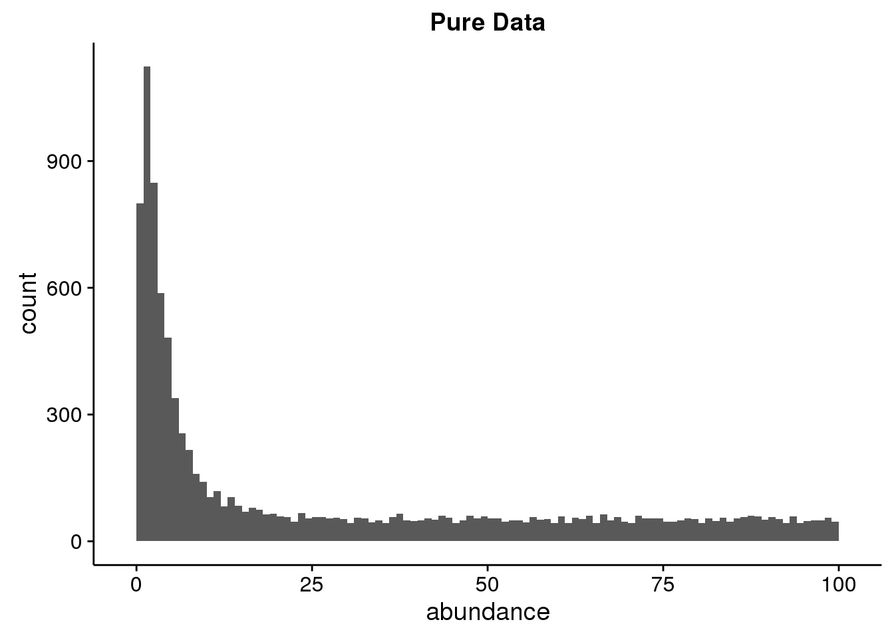

### Additive Error


Additive error was added where the standard deviation was 2. A plot
of two replicates is shown in Figure X.

### Proportional Error


Proportional error was added where the standard deviation was 0.1. A
plot of two replicates is shown in Figure X.

### Mixed Error


Mixture of additive and proportional error was added with standard deviations
of 2 and 0.1 respectively.

## Transformations

The transformations applied to the data include variance scaling, the
log-transform (log10), and power transform (root 2 and 5).

# Results

Very often, high-throughput -omics replicates are visualized in a pairwise
manner, by plotting the replicates directly against each other, or rotating them
by 45 degrees as a Bland-Altman or MA plot (see Figure Xa and b). Overviews of
many replicate / samples can be provided by summarizing each pair by the
correlation or root mean squared error (RMSE), however neither of these provide
a way to view how or if errors are related to the value of a feature across all
replicates. The pairwise MA plot allows this for pairs, but examining a large
number of pairwise plots is tedious.

One simple extension is for each feature, to plot the difference between the
minimum and maximum value across replicates, vs the mean value, as shown in
Figure Xc. A more robust metric with much of the same meaning is to use the
standard deviation, plotted against the mean. This actually shows if there is
any relationship between the error (standard deviation) and the mean, which can
provide an indication of whether there is additive, or proportional errors
present. Plotting the *relative standard deviation* (RSD, SD / mean) *vs the
mean* as well as *sd vs mean*  makes it possible to discern the presence of
additive, proportional, or mixed error ( see Figures X-Y for examples).

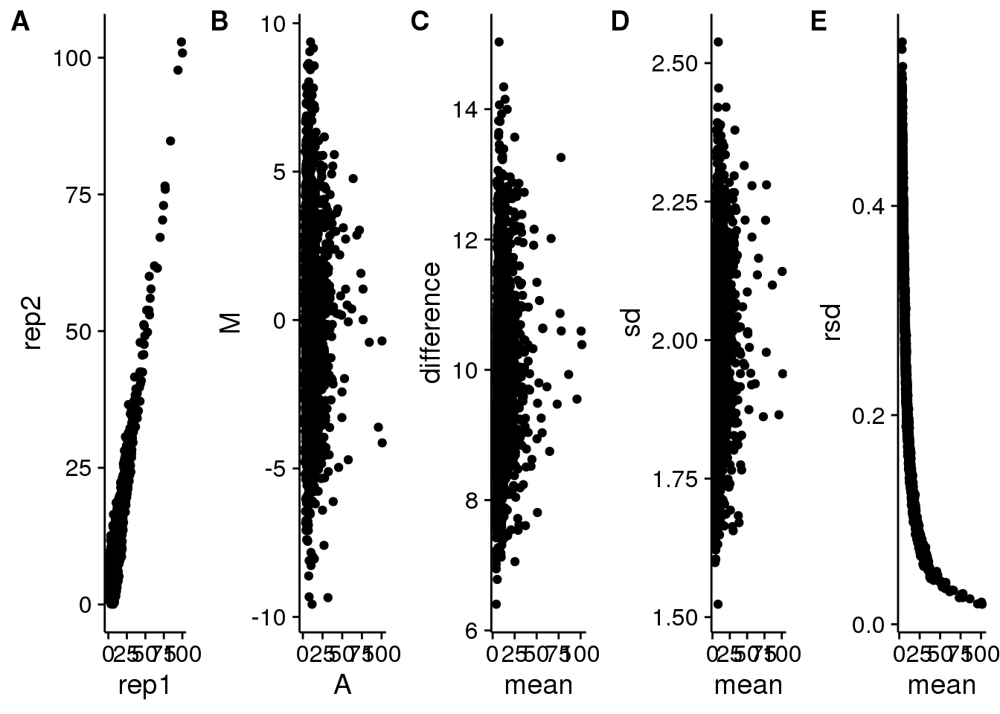


## No Transformation

With no transformation, **all** of the data have a **log-normal** distribution.

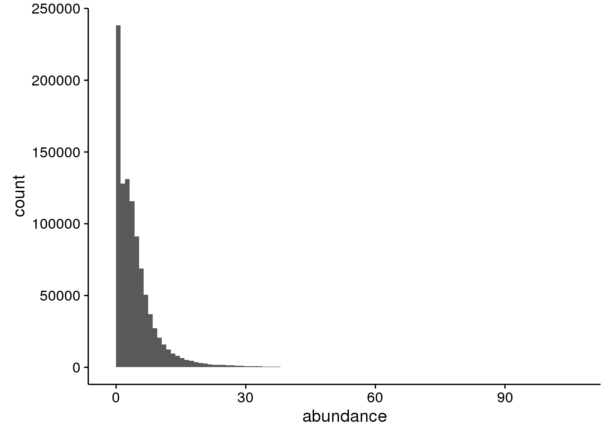


### Additive Error

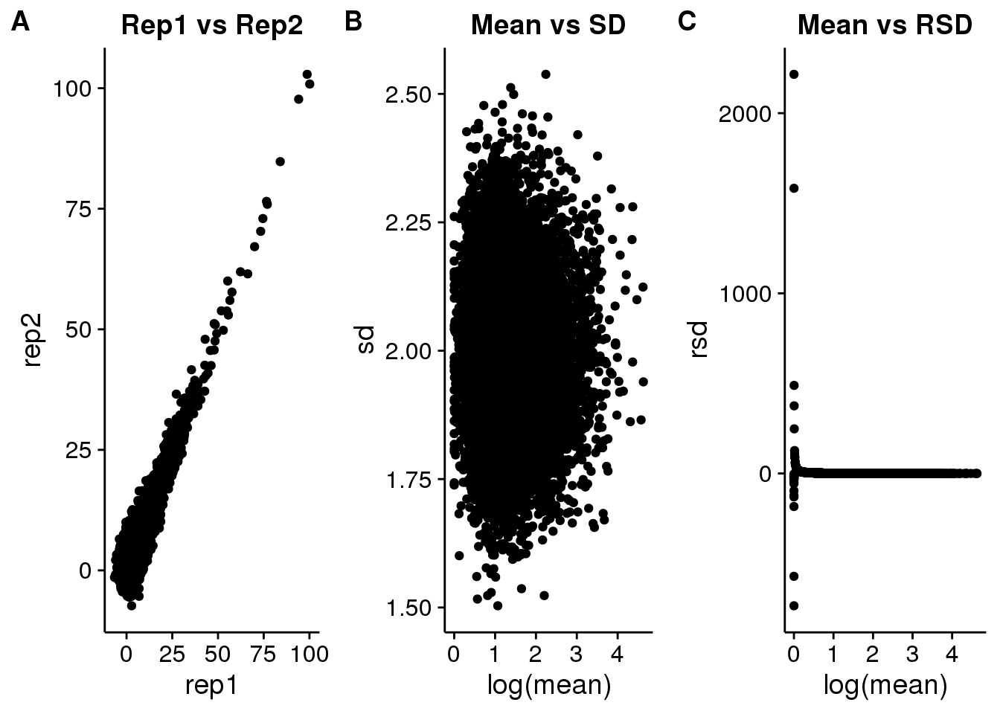

### Proportional Error

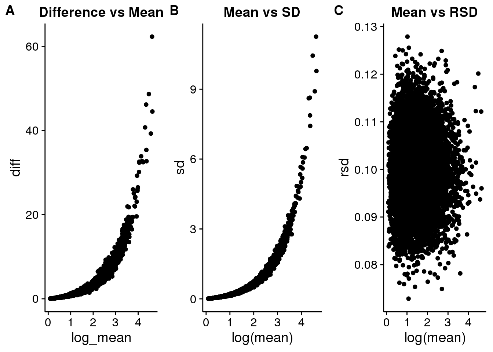

### Mixed Error

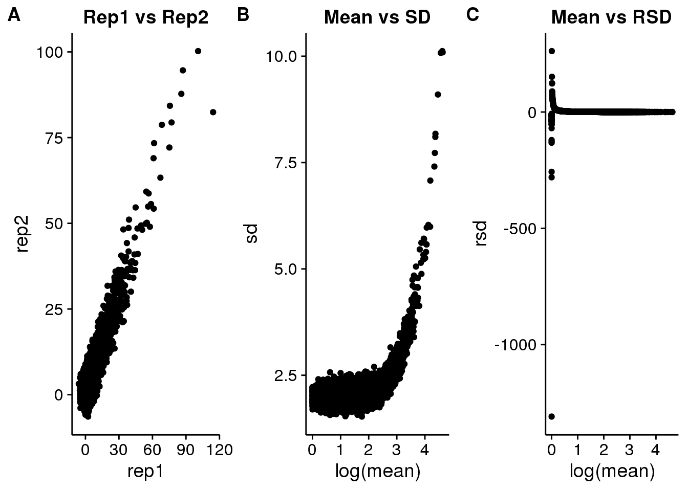

## Log Transformation

Applying the **log-transform** to the data results in:

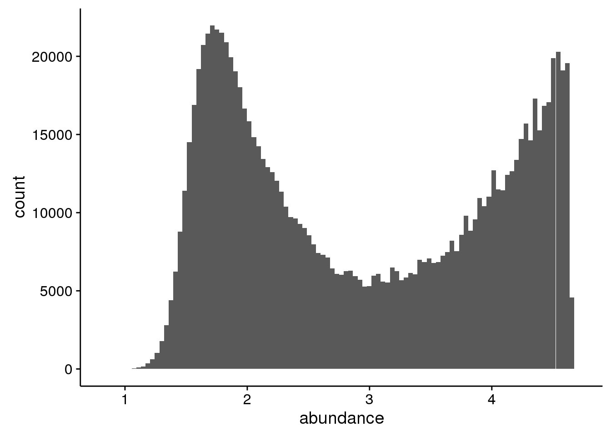

### Additive Error

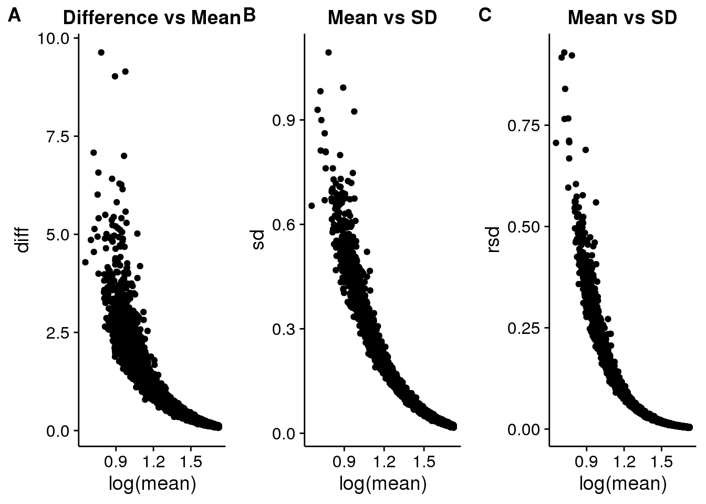

### Proportional Error


```
## Warning: Removed 234 rows containing missing values (geom_point).
```

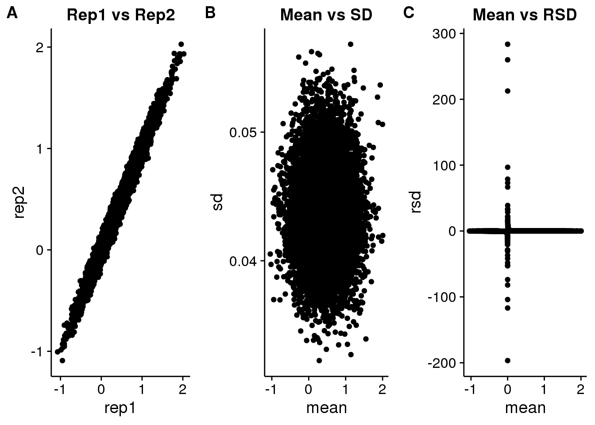

### Mixed Error

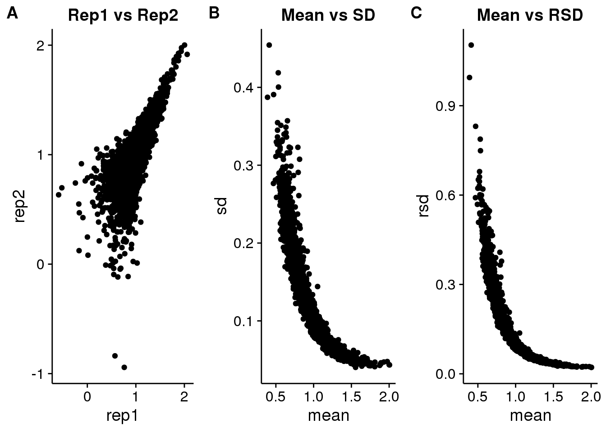

## Root Transform

A square root transform was applied to the data. The choice of using 2 as the
root is arbitrary, however depending on the size of the **tails** of the data
a higher root may be useful. 


### Additive Error

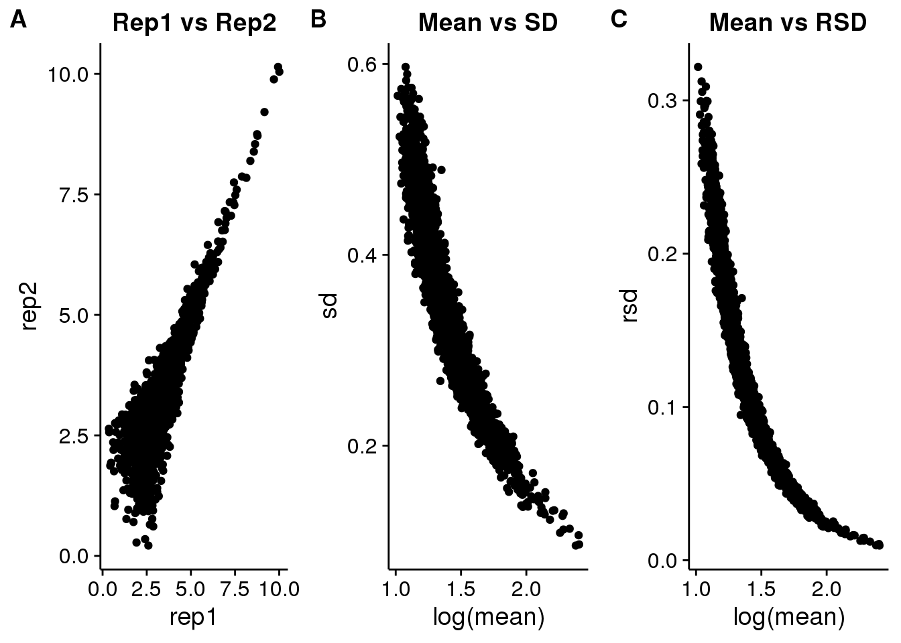

### Proportional Error

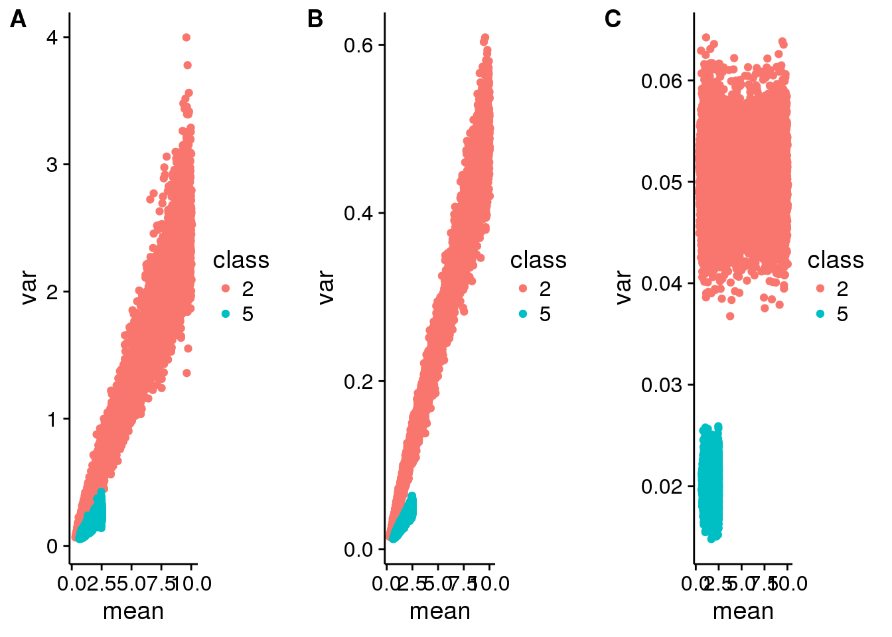

### Mixed Error

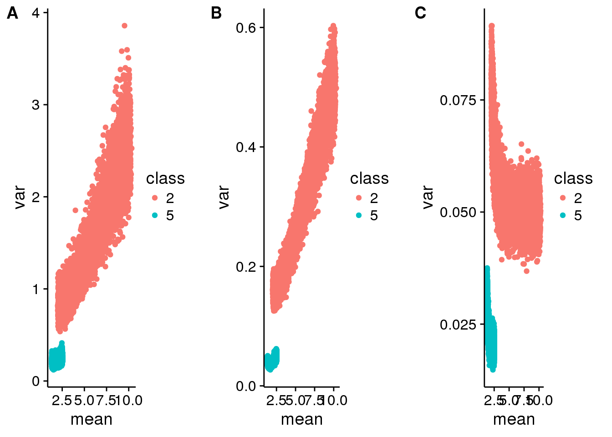


# Conclusion


# Session Information


```
##  setting  value                       
##  version  R version 3.2.3 (2015-12-10)
##  system   x86_64, linux-gnu           
##  ui       RStudio (0.99.825)          
##  language (EN)                        
##  collate  en_US.UTF-8                 
##  tz       America/New_York            
##  date     2016-01-13
```


|package                     |*  |version     |date       |source                                   |
|:---------------------------|:--|:-----------|:----------|:----------------------------------------|
|assertthat                  |   |0.1         |2013-12-06 |CRAN (R 3.2.2)                           |
|circlize                    |   |0.3.2       |2015-10-21 |CRAN (R 3.2.2)                           |
|colorspace                  |   |1.2-6       |2015-03-11 |CRAN (R 3.2.2)                           |
|ComplexHeatmap              |   |1.7.1       |2015-10-10 |Github (jokergoo/ComplexHeatmap@e502955) |
|cowplot                     |*  |0.6.0       |2015-12-19 |CRAN (R 3.2.2)                           |
|DBI                         |   |0.3.1       |2014-09-24 |CRAN (R 3.2.2)                           |
|dendextend                  |   |1.1.2       |2015-10-31 |CRAN (R 3.2.2)                           |
|dendsort                    |   |0.3.3       |2015-12-14 |CRAN (R 3.2.2)                           |
|devtools                    |   |1.9.1.9000  |2015-11-18 |Github (hadley/devtools@b4edf3e)         |
|digest                      |   |0.6.9       |2016-01-08 |CRAN (R 3.2.3)                           |
|dplyr                       |*  |0.4.3       |2015-09-01 |CRAN (R 3.2.2)                           |
|evaluate                    |   |0.8         |2015-09-18 |CRAN (R 3.2.2)                           |
|fakeDataWithError           |*  |0.0.1       |2015-10-19 |local                                    |
|formatR                     |   |1.2.1       |2015-09-18 |CRAN (R 3.2.2)                           |
|GetoptLong                  |   |0.1.0       |2015-03-09 |CRAN (R 3.2.2)                           |
|ggbiplot                    |   |0.55        |2015-10-19 |Github (rmflight/ggbiplot@7325e88)       |
|ggplot2                     |*  |2.0.0       |2015-12-18 |CRAN (R 3.2.2)                           |
|git2r                       |   |0.11.0.9000 |2015-10-15 |Github (ropensci/git2r@7414c11)          |
|GlobalOptions               |   |0.0.8       |2015-08-18 |CRAN (R 3.2.2)                           |
|gtable                      |   |0.1.2       |2012-12-05 |CRAN (R 3.2.2)                           |
|htmltools                   |   |0.2.6       |2014-09-08 |CRAN (R 3.2.2)                           |
|knitr                       |   |1.11        |2015-08-14 |CRAN (R 3.2.2)                           |
|labeling                    |   |0.3         |2014-08-23 |CRAN (R 3.2.2)                           |
|lazyeval                    |   |0.1.10      |2015-01-02 |CRAN (R 3.2.2)                           |
|magrittr                    |   |1.5         |2014-11-22 |CRAN (R 3.2.2)                           |
|memoise                     |   |0.2.1       |2014-04-22 |CRAN (R 3.2.2)                           |
|munsell                     |   |0.4.2       |2013-07-11 |CRAN (R 3.2.2)                           |
|plyr                        |   |1.8.3       |2015-06-12 |CRAN (R 3.2.2)                           |
|R6                          |   |2.1.1       |2015-08-19 |CRAN (R 3.2.2)                           |
|RColorBrewer                |   |1.1-2       |2014-12-07 |CRAN (R 3.2.2)                           |
|Rcpp                        |   |0.12.3      |2016-01-10 |CRAN (R 3.2.3)                           |
|rjson                       |   |0.2.15      |2014-11-03 |CRAN (R 3.2.2)                           |
|rmarkdown                   |   |0.9.2       |2016-01-01 |CRAN (R 3.2.3)                           |
|scales                      |   |0.3.0       |2015-08-25 |CRAN (R 3.2.2)                           |
|shape                       |   |1.4.2       |2014-11-05 |CRAN (R 3.2.2)                           |
|stringi                     |   |1.0-1       |2015-10-22 |CRAN (R 3.2.2)                           |
|stringr                     |   |1.0.0       |2015-04-30 |CRAN (R 3.2.2)                           |
|visualizationQualityControl |*  |0.0.26      |2016-01-08 |local                                    |
|whisker                     |   |0.3-2       |2013-04-28 |CRAN (R 3.2.2)                           |
|yaml                        |   |2.1.13      |2014-06-12 |CRAN (R 3.2.2)                           |


# Create Markdown


```r
rmarkdown::render("glbio2016_manuscript.Rmd", clean = FALSE)
```
